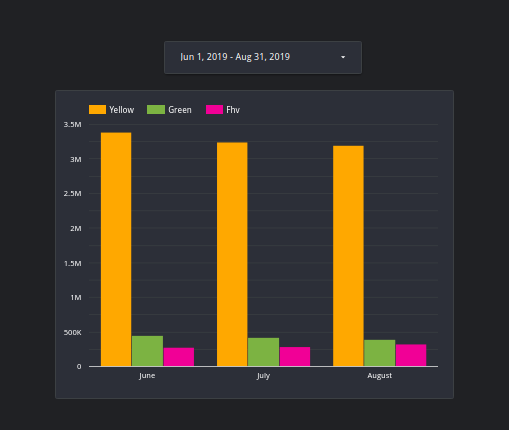

In week 4️⃣ of the Data Engineering Zoomcamp we learned about 

👷🏢 Analytics Engineering  
The analytics engineer is a relatively recent role that plays an important role within a data team. A good AE brings good software engineering skills and best practices, such as 📝 documentation, 🧩 modularity, 🧪 testing, 📁 version control, and 🧬 data lineage to support data analysts and data scientists.

🛢️🔄DBT  
dbt (Data Build Tool) is a SQL friendly workflow transformation tool that introduces SE best practices to the analytics workflow. 🛠️✨

💡🛠️DBT Concepts and Features  
In dbt, models are the heartbeat of the workflow. They are select statements that abstract DDL and DML that dbt compiles and runs into a data warehouse. The command dbt build compiles and deploys the models. 🏗️
Macros and packages are modular components that can be used to introduce complex logic to our models (similar to packages / libraries in other programming languages). The command dbt deps builds the dependencies used in our code. 📦
Variables are another useful feature in dbt that can be used from the command line or inside the code. 🔧

🧪🚀Testing & Deployment in dbt Cloud  
dbt allows us to run various tests, such as uniqueness, nulls, accepted values, and foreign keys, that can be easily defined in .yml files. 🛠️ In dbt cloud, development always happens in a branch that can later be merged into our project, giving us more control over the deployment. 🌐 dbt cloud also allows us to use webhooks to manage our CI/CD processes. 🔄

👉 I used dbt to connect to BigQuery, created a schema where I defined data sources, defined staging and core models to extract, transform and load taxi trips data in my warehouse, and used looker studio to create a simple chart that showed trip counts by service line and month:

 You can find the code [here](https://github.com/el-grudge/data-engineering-zoomcamp/tree/main/week_4). 

#data_engineering_zoomcamp #analytics_engineering #dbt #data_engineering #learning_in_public